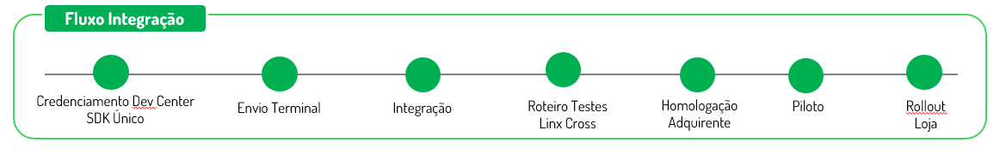
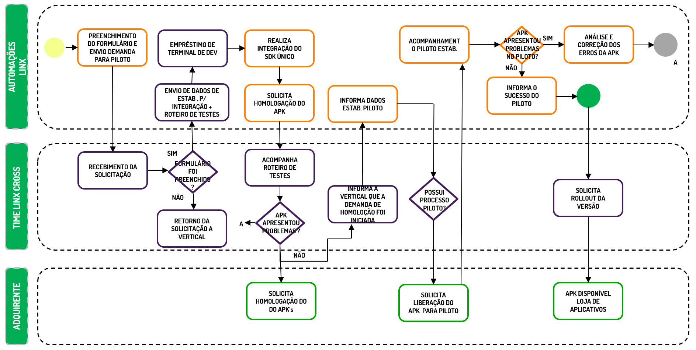

# Processo de Integração

Para se integrar com o SDK Único, você precisa passar as seguintes etapas:

{ loading=lazy }

Disponibilizamos um ambiente de sandbox (testes) onde é possível simular todas as situações que ocorrem em produção, como transações negadas e timeout. 
Para receber uma credencial de integração, é necessário se cadastrar em nosso programa de parcerias. 
Cadastre-se aqui.

{ loading=lazy }

| Etapa      | Atividade  |
| ---------- | ---------- |
| `Credenciamento` | 
Cadastro no Portal de Desenvolvimento do Sdk Único
 |  
|  | 
Solicitação de terminal de desenvolvimento
|  
| `Download` | 
Baixar a última versão do SDK Único
 |  
|  | 
Baixar o aplicativo de Demonstração
|  
| `Desenvolvimento` | 
Integração da chamada de Pagamento em crédito à vista (Crédito a vista)
 |  
|  | 
Integração da chamada de Pagamento em crédito sem juros (Crédito Parcelado)
|  
|  | 
Integração da chamada de Pagamento em crédito com juros (Crédito Parcelado Emissor)
|  
|  | 
Integração da chamada de Pagamento em débito (Débito)
|  
|  | 
Integração da chamada chamada de Pagamento por voucher (Voucher)
|  
|  | 
Integração da chamada de Estorno de Pagamentos
|  
|  | 
Integração da chamada de Impressão de Comprovantes
|  
| `Distribuição do APK` | 
Selecionar o versão do SDK Único específica da adquirente que deseja transacionar
 |  
|  | 
Gerar Deploy do APK compatível com a adquirente selecionada.
|  
| `Roteiro de Testes` | 
Execução dos roteiros de testes acompanhados pela equipe Linx Cross.
 |  
|  | 
Acompanhamento da execução e correções de Bug's no APK.
|  
| `Homologação Adquirente` | 
Essa etapa será apoiada pelo time Linx Cross, que irá preencher formulário de Certificação, enviar e apoiar no roteiro de testes.
 |  
| `Piloto` | 
Envio dos dados do estabelecimento que irá participar do projeto Piloto.
 |  
|  | 
Acompanhamento da execução e correções de Bug's no APK.
|  
| `Produção` | 
Ao final da certificação recebendo será realizada a etapa de publicação do APK na loja da adquirente.
 |  
