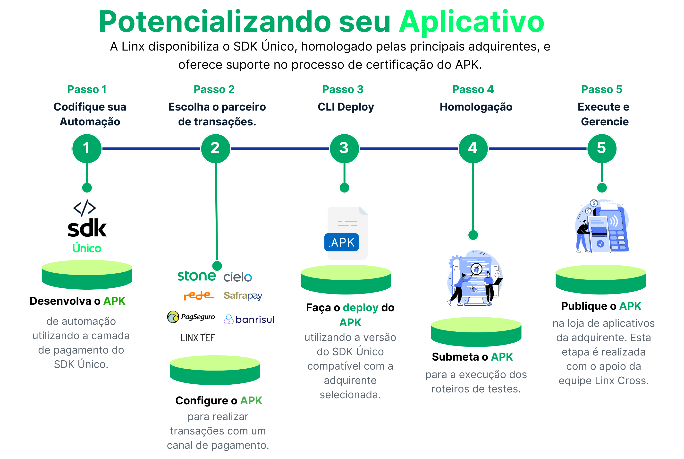

# SDK Único

O SDK Único é uma plataforma completa de integração Android para os desenvolvedores construirem, implantarem, gerenciarem e escalarem a camada de pagamento das automações, nos dispositivos Smart Android das Adquirentes.

## Visão da Solução

O SDK Único atualmente suporta as seguintes operações.

{ loading=lazy }

  [Visão da Solução]: assets/images/visao-solucao.png
  

## Operações Disponíveis por SDK

A seguinte tabela resume as operações disponíveis para cada SDK de adquirente integrado ao SDK Único.

| Operação   | TEF   | Stone | PagSeguro | REDE  |
|------------|-------|-------|-----------|-------|
| Ativar     | ✔️     | ✔️     | ✔️         | ✔️     |
| Crédito    | ✔️     | ✔️     | ✔️         | ✔️     |
| Débito     | ✔️     | ✔️     | ✔️         | ✔️     |
| Voucher    | ✔️     | ✔️     | ❌         | ✔️     |
| PIX        | ✔️     | ✔️     | ✔️         | ❌     |
| Cancelar   | ✔️     | ✔️     | ✔️         | ✔️     |
| Reversão   | ✔️     | ✔️     | ❌         | ✔️     |
| Reimprimir | ✔️     | ✔️     | ❌         | ✔️     |

- "✔️" indica que a operação é suportada pelo SDK.
- "❌" indica que a operação não é suportada pelo SDK.

Esta tabela facilita a visualização das funcionalidades que cada adquirente oferece através do SDK Único.
  [Visão da Solução]: assets/images/visao-solucao.png

## Adquirentes Integradas

- Stone
- Linx Tef

## Adquirentes Em Desenvolvimento

- Rede
- Pag Seguro
- Get Net
- Cielo
- Safra Pay
- Banrisul Vero

## Dispositivos Suportados

- Sunmi P2-B
- Positivo L400
- Positivo L300
- Gertec GPOS 700X
- Gertec GPOS 700