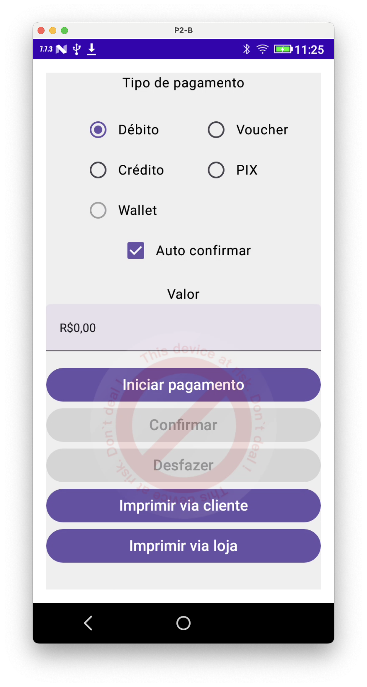

# Projeto Exemplo

Para realizar testes com o SDK Único, é preciso selecionar com qual SDK deseja realizar a transação. Para tal, disponiblizamos uma App de Exemplo específica por SDK de adquirente.

{ loading=lazy, width="500" }

| SDK         | Versão SDK Adquirente  | Versão SDK Único     | Link                                 |
| ----------- | -------------------| ---------------------| ------------------------------------ |
| `DTEF`      | 1.0.3              | 1.1.1                | [Download](https://site-to-download)  |
| `Stone`     | 1.0.3              | 1.1.1                | [Download](https://site-to-download)  |
| `REDE`      | 1.0.3              | 1.1.1                | [Download](https://site-to-download)  |
| `PagSeguro` | 1.0.3              | 1.1.1                | [Download](https://site-to-download)  |
| `Getnet`    | 1.0.3              | 1.1.1                | [Download](https://site-to-download)  |